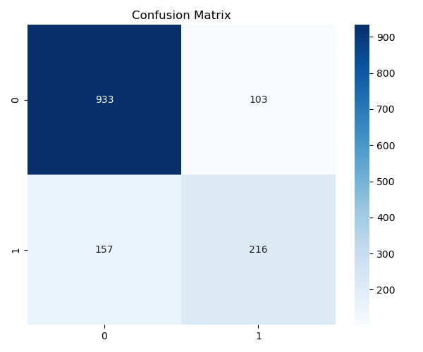

# Telco Customer Churn Prediction

An end-to-end machine learning project for predicting customer churn using the **IBM Telco Customer Churn dataset**.

The project demonstrates a complete machine learning workflow including data cleaning, preprocessing, feature preparation, model training, evaluation, and business interpretation using **Python and Scikit-learn**.

---

## Problem Statement

Customer churn is a major challenge for telecommunications companies. Losing existing customers can directly affect revenue and increase the cost of customer acquisition.

The objective of this project is to build a machine learning model that predicts whether a customer is likely to discontinue their service based on demographic information, account details, service usage, and billing characteristics.

Such predictions can help businesses identify customers at risk of churn and support targeted customer-retention strategies.

---

## Dataset

The project uses the **IBM Telco Customer Churn dataset**.

| Attribute | Value |
|---|---|
| Total Records | 7,043 |
| Original Features | 20 |
| Target Variable | `Churn` |
| Problem Type | Binary Classification |

The dataset contains customer information including:

- Demographic information
- Account tenure
- Internet and phone services
- Contract type
- Payment method
- Monthly charges
- Total charges
- Customer churn status

---

## Machine Learning Workflow

The project follows the following workflow:

1. Data Loading
2. Dataset Inspection
3. Data Cleaning
4. Data Preprocessing
5. Feature Selection
6. Train-Test Split
7. Feature Scaling
8. Model Training
9. Model Evaluation
10. Business Interpretation

---

## Data Cleaning

Several preprocessing steps were applied before model training:

- Blank values were converted to missing values.
- `TotalCharges` was converted from object/string format to numeric.
- Missing values in `TotalCharges` were filled using the median.
- `customerID` was removed because it does not provide useful predictive information.

After cleaning, the dataset contained **19 input features** and the target variable `Churn`.

---

## Data Preprocessing

Categorical variables were converted into numerical values using `LabelEncoder`.

The target variable:

```text
Churn
```

was separated from the input features.

The dataset was then divided into:

| Split | Samples |
|---|---:|
| Training Set | 5,634 |
| Test Set | 1,409 |

An **80/20 train-test split** was used with:

```python
random_state=42
```

Feature scaling was performed using `StandardScaler`.

---

## Model

The classification model used in this project is:

### Logistic Regression

Model configuration:

```python
LogisticRegression(
    random_state=42,
    max_iter=1000
)
```

Logistic Regression provides a simple and interpretable baseline for binary classification problems such as customer churn prediction.

---

## Model Performance

The trained model was evaluated on the held-out test set.

| Metric | Result |
|---|---:|
| Accuracy | **81.55%** |
| Macro F1-Score | **0.75** |
| Weighted F1-Score | **0.81** |
| Churn Precision | **0.68** |
| Churn Recall | **0.58** |
| Churn F1-Score | **0.62** |

### Classification Performance

| Class | Precision | Recall | F1-Score | Support |
|---|---:|---:|---:|---:|
| No Churn | 0.86 | 0.90 | 0.88 | 1,036 |
| Churn | 0.68 | 0.58 | 0.62 | 373 |
| **Accuracy** |  |  | **0.82** | **1,409** |

---

## Confusion Matrix

The model produced the following confusion matrix:

| | Predicted No Churn | Predicted Churn |
|---|---:|---:|
| **Actual No Churn** | 933 | 103 |
| **Actual Churn** | 157 | 216 |



The model correctly classified approximately **81.6% of customers**.

For customers who actually churned, the model achieved a recall of **0.58**, meaning that it identified 216 of the 373 churn cases in the test set.

While overall accuracy is strong for a baseline model, improving churn recall would be particularly important in a real customer-retention system.

---

## Business Interpretation

The model can be used as an initial customer-risk screening tool to help telecommunications companies:

- Identify customers who may be at risk of leaving.
- Prioritize customers for retention campaigns.
- Support data-driven customer-management decisions.
- Reduce potential revenue loss associated with customer churn.

The current model should be considered a **baseline machine learning system** rather than a production-ready churn solution.

---

## Project Structure

```text
telco-customer-churn-prediction/
│
├── data/
│   └── WA_Fn-UseC_-Telco-Customer-Churn.csv
│
├── images/
│   └── confusion_matrix.png
│
├── notebooks/
│   └── telco_customer_churn_prediction.ipynb
│
├── outputs/
│   └── predictions.csv
│
├── .gitignore
├── README.md
└── requirements.txt
```

---

## Technologies Used

| Technology | Purpose |
|---|---|
| Python | Programming language |
| Pandas | Data manipulation |
| NumPy | Numerical operations |
| Matplotlib | Data visualization |
| Seaborn | Statistical visualization |
| Scikit-learn | Machine learning and evaluation |
| Jupyter Notebook | Experimentation and development |

---

## How to Run the Project

### 1. Clone the repository

```bash
git clone https://github.com/Manan-Paliwal/telco-customer-churn-prediction.git
```

### 2. Enter the project directory

```bash
cd telco-customer-churn-prediction
```

### 3. Install the required dependencies

```bash
pip install -r requirements.txt
```

### 4. Launch Jupyter Notebook

```bash
jupyter notebook
```

Open:

```text
notebooks/telco_customer_churn_prediction.ipynb
```

and run the notebook cells sequentially.

---

## Current Limitations

This project currently uses a relatively simple baseline pipeline.

Some limitations include:

- Only Logistic Regression is evaluated.
- Categorical variables are encoded using `LabelEncoder`.
- Hyperparameter optimization has not been performed.
- The train-test split is not stratified.
- Class imbalance is not explicitly handled.
- Additional churn-focused metrics such as ROC-AUC and PR-AUC are not currently evaluated.
- The model has not been deployed or tested on live customer data.

---

## Future Improvements

Possible improvements include:

- Use `OneHotEncoder` or `ColumnTransformer` for categorical features.
- Compare Logistic Regression with Random Forest, XGBoost, and other classifiers.
- Apply stratified train-test splitting.
- Investigate class imbalance handling techniques.
- Perform cross-validation.
- Perform hyperparameter optimization.
- Evaluate ROC-AUC and Precision-Recall AUC.
- Analyze feature importance and model interpretability.
- Improve recall for churn customers.
- Build an interactive prediction interface.
- Deploy the trained model as a web application or API.

---

## Key Learning Outcomes

This project demonstrates practical experience with:

- Data cleaning and preprocessing
- Working with categorical data
- Feature and target separation
- Train-test splitting
- Feature scaling
- Binary classification
- Logistic Regression
- Confusion matrix analysis
- Precision, recall, and F1-score
- Translating model results into business context

---

## Author

**Manan Paliwal**

B.Tech Computer Science Engineering — Artificial Intelligence & Machine Learning

Focused on **Machine Learning, Deep Learning, and Computer Vision**.

GitHub: [Manan-Paliwal](https://github.com/Manan-Paliwal)  
LinkedIn: [manan-paliwal](https://www.linkedin.com/in/manan-paliwal)

---

## Disclaimer

This project was created for learning, experimentation, and portfolio purposes.

The model is not intended to be used directly for production customer-retention decisions without further validation, monitoring, and improvement.
